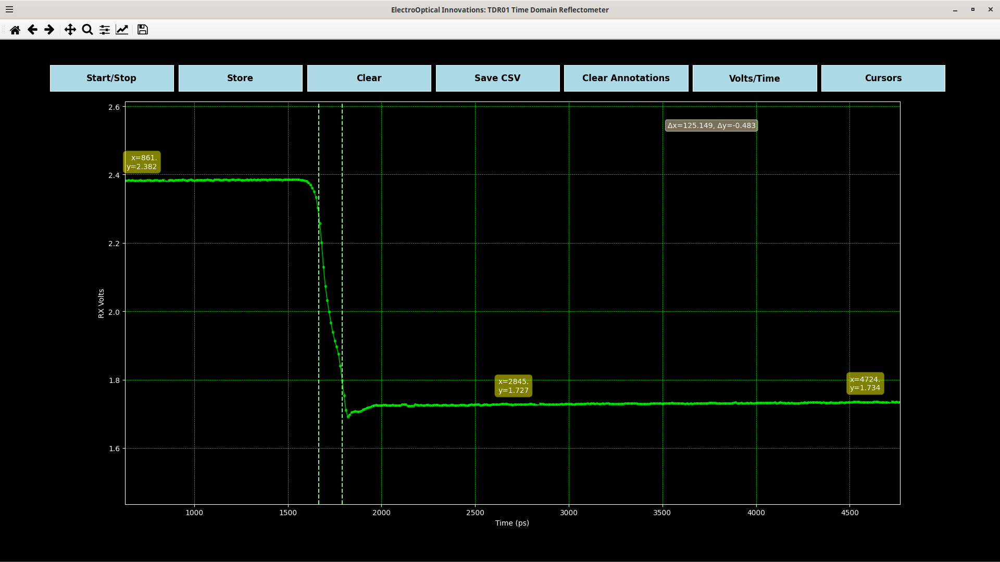

# Live Plotting Tool for the TDR01

## Introduction
The current tool is a basic live plotting function which communicates with the TDR01 serial interface with VISA.
The plotting function includes saving traces, storing traces for comparison, and cursor annotations.
The TDR01 is a compact, rugged, and cost-effective Time Domain Reflectometer (TDR) with 60ps edges (90-10%).
16 bit timing precision allows for single picosecond resolution.





### Basic Commands

The device is a SCPI compliant interface (std V1999.0 4.2.1) over a 115.2k baud 8n1 3.3V UART.
+ `*IDN`: 
+ `TRACE`: Starts a data trace and returns an `NPOINTS` long CSV of 12 bit values terminated with a new line (standard SCPI). If averaging is used then each point is the sum of the repeated runs. The scale factor to volts is then 3.6V/(`AVG` * 2^12).
+ `RXDAC?`: Returns the dac settings of each point on the timing ramp. The peak ramp voltage is configurable with `DA` and `DB`
+ `NPOINTS`: Number of points in a trace.
+ `AVG`: Number of averages per point
+ `RES`: Spacing between consecutive points in integer picoseconds 
+ `ISTART`: Starting index of the trace. The start time is `RES`x`ISTART`.
+ `PULSES`: Number if integration points per measurement
+ `RAMP`: Choose the ramp time constant (1: Fast, 2: Slow)


## Installation & Use 
The live trace plot is a python package in a TKinter environment.
The tool has been tested on Windows 11 and Ubuntu 24.04 with Ubuntu as the primary platform.

### Ubuntu Dependencies
```bash
apt-get update
apt-get install -y \
    python3-tk \
    tk \
    x11-utils \
    libx11-6 \
    libx11-xcb1 \
    libxcb1 \
    libxext6 \
    libxrender1 \
    libxrandr2 \
    libxi6
```
### Use
```bash
monitor_tdr --device /dev/ttyUSB0
```

```bash
monitor_tdr --help

Usage: monitor_tdr [OPTIONS]

Options:
  --sleep FLOAT        Sleep time in between traces
  --m FLOAT
  --rc FLOAT
  --start_time FLOAT
  --ramp_mode INTEGER
  --spacing INTEGER
  --maxtime INTEGER
  --device TEXT
  --help               Show this message and exit.
```

## Precompiled Binaries
Precompiled binaries are available under releases.

```bash
dist/monitor_tdr --device /dev/ttyUSB0
```

### Building Binaries
First install in a clean virtual environment and run:
```bash
pyinstaller pyinstaller.spec
```


## Installation From Source
If installing locally then a virtual environment or anaconda should be used.

```bash
pip install .
```

